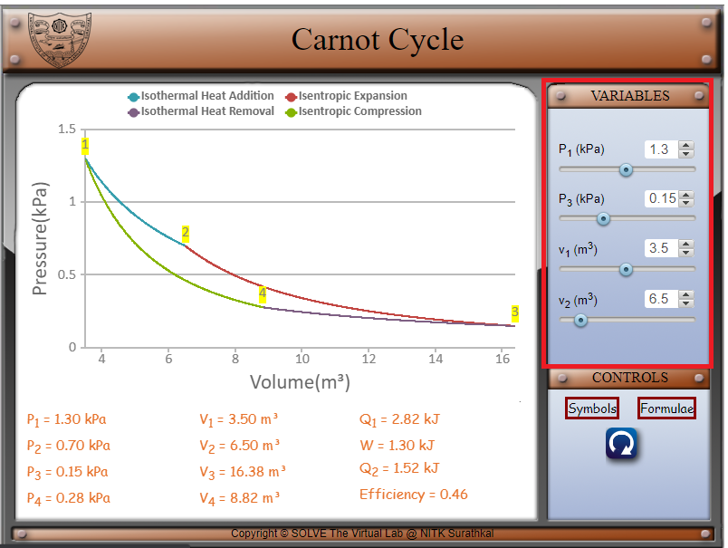
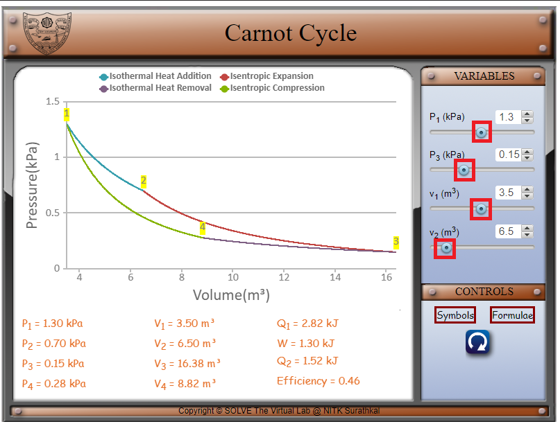
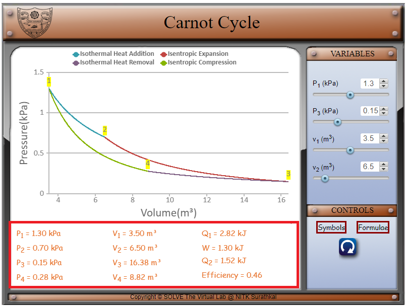
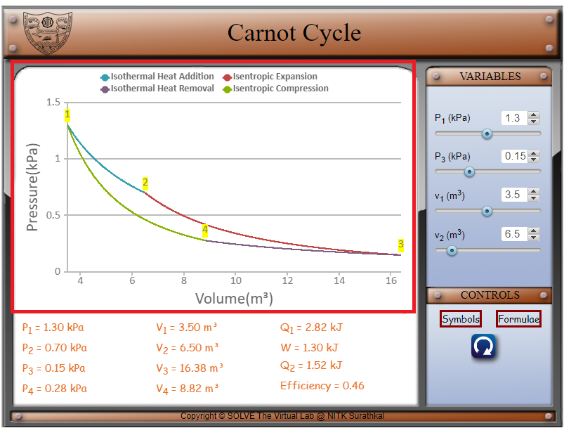

#### These procedure steps will be followed on the simulator

1. In the simulation window, the Carnot cycle graph is displayed.

 

2. The various symbols and the formulae involved in the experiment are displayed in the control panel when the cursor hovers over ‘Symbols’ and ‘Formulae’ respectively.

 

 

3. The parameters of the system can be changed by changing the variables as shown below. 

 

4. Move the sliders’ knobs to vary the pressures P1 and P3, the volumes v1 and v2. P1 can be varied from 1.1 to 1.5 kPa. P3 can be varied from 0.1 to 0.25 kPa. V1 can be varied from 2 to 5 m3. V2 can be varied from 6 to 9 m3. 

 

5. P1, P2, P3, P4, v1, v2, v3, v4, the heat added Q1, work done W, the heat removed Q2 and the efficiency are displayed at the bottom. 

 

6. Visualize the change in the graph as the various parameters are changed.

 
