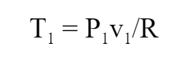
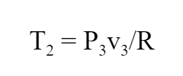
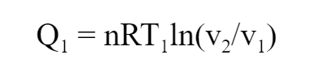
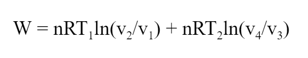
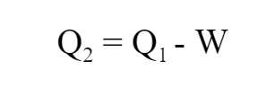
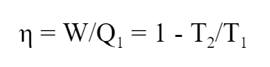

## INTRODUCTION 

Carnot cycle is an ideal thermodynamics cycle proposed by the French physicist Sadi Carnot. It consists of two isothermal and two reversible adiabatic curves. The cycle provides the maximum possible efficiency that can be obtained by any thermodynamic cycle.

#### User Objectives and Goals: 

1. Understand the various processes involved in the Carnot cycle.
2. Portray the change in the graph as the parameters are changed.
3. Calculate the heat added, work done and the heat removed.
4. Calculate the efficiency of the Carnot cycle.

#### Theory 

Carnot cycle is an ideal thermodynamics cycle proposed by the French physicist Sadi Carnot. It consists of two isothermal and two reversible adiabatic curves. The cycle provides the maximum possible efficiency that can be obtained by any thermodynamic cycle.

The various processes involved are explained below:

1-2 - This is the isothermal heat addition phase, where there is a reversible adiabatic (or isentropic) heat transfer from the hot reservoir at constant temperature.

2-3 - This is the isentropic expansion phase, where the gas in the engine is thermally insulated from the hot and cold reservoirs and expanded.

3-4 - This is the isothermal heat removal phase, where there is a reversible adiabatic (or isentropic) heat transfer to the cold reservoir at constant temperature.

4-1 - This is the isentropic compression phase, where the gas in the engine is thermall insulated from the hot and cold reservoirs and compressed.

In this experiment, the Carnot cycle is demonstrated so that the user can understand how the P-V graph changes as various pressure and volume parameters change.

#### Abbreviations: 

1. P1, v1, T1 = Pressure, volume and temperature values at the beginning of Process 1-2
2. P2, v2, T2 = Pressure, volume and temperature values at the beginning of Process 2-3
3. P3, v3, T3 = Pressure, volume and temperature values at the beginning of Process 3-4
4. P4, v4, T4 = Pressure, volume and temperature values at the beginning of Process 4-1
5. γ = Heat capacity ratio (adiabatic index) = 1.667
6. R = Molar gas constant = 8.314
7. Q1 = Heat absorbed by the system
8. W = Work done by the system
9. Q2 = Heat rejected by the system
10. η = Efficiency of the Carnot cycle

#### Equations/formulae: 

 

 

 

 

 

 
