## Storyboard (Round 2)

Experiment: Carnot Cycle

**1. Story Outline**:

Carnot cycle is an ideal thermodynamics cycle proposed by the French physicist Sadi Carnot. It consists of two isothermal and two reversible adiabatic curves. The cycle provides the maximum possible efficiency that can be obtained by any thermodynamic cycle.

The various processes involved are explained below:

1-2 - This is the isothermal heat addition phase, where there is a reversible adiabatic (or isentropic) heat transfer from the hot reservoir at constant temperature.

2-3 - This is the isentropic expansion phase, where the gas in the engine is thermally insulated from the hot and cold reservoirs and expanded.

3-4 - This is the isothermal heat removal phase, where there is a reversible adiabatic (or isentropic) heat transfer to the cold reservoir at constant temperature.

4-1 - This is the isentropic compression phase, where the gas in the engine is thermall insulated from the hot and cold reservoirs and compressed.

In this experiment, the Carnot cycle is demonstrated so that the user can understand how the P-V graph changes as various pressure and volume parameters change.

 **2. Story**:

  **2.1 Set the visual stage description**:

  The experiment consists of the Carnot cycle P-V graph. All the buttons and parameters are on the right side of the frame. The variable panel contains sliders for the pressures P1 and P3 and the volumes V1 and V2.

  The setup consists of a graph that depicts the Carnot cycle. A legend at the top indicates the processes involved in each of the curves.

  By changing the various parameters, the P-V graph changes.

  **2.2 Set User Objectives & Goals**:

  1. Understand the various processes involved in the Carnot cycle.
  2. Portray the change in the graph as the parameters are changed.
  3. Calculate the heat added, work done and the heat removed.
  4. Calculate the efficiency of the Carnot cycle.

  **2.3 Set the pathway activities**:

  1. The initial P1 is taken as 1.1 kPa.  
  2. The initial P3 is taken as 0.1 kPa.  
  3. The initial V1 is taken as 2 m3.  
  4. The initial V2 is taken as 6 m3.  
  5. P1 is varied from 1.1 to 1.5 kPa using a slider.  
  6. P3 is varied from 0.1 to 0.25 kPa using a slider.  
  7. V1 is varied from 2 to 5 m3 using a slider.  
  8. V2 is varied from 6 to 9 m3 using a slider.  

  Change the parameters of the system to understand the behaviour of the Carnot cycle.

  **2.4 Set Challenges and Questions/Complexity/variation**

  **2.4.a Questions before simulation**:

  1. What is the working fluid for the Carnot cycle?

    <ol type="a">
   <li>Ideal gas</li>
   <li>Real gas</li>
   <li>Natural gas</li>
   <li>None of the above</li>
   </ol>

   Answer: a

  2. The isothermal process of the Carnot cycle requires _____ movement of the piston to maintain constant temperature:

  <ol type="a">
  <li>Very slow</li>
  <li>Very fast</li>
  <li>Variable</li>
  <li>Medium</li>
  </ol>

  Answer: a

  3. The Carnot cycle consists of:

  <ol type="a">
  <li>Two isochores and two isothermal curves</li>
  <li>Two isobars and two isothermal curves</li>
  <li>Two isotherms and two reversible adiabatic curves</li>
  <li>Two isobars and two reversible adiabatic curves</li>
  </ol>

  Answer: c

  4. The area under the Carnot cycle graph represents the:

   <ol type="a">
  <li>Work done by the system</li>
  <li>Total entropy change in the system</li>
  <li>Heat added to the system</li>
  <li>Efficiency of the cycle</li>
  </ol>

  Answer: a

  5. Which of the following cycles has the highest efficiency?

   <ol type="a">
  <li>Otto</li>
  <li>Brayton</li>
  <li>Dual</li>
  <li>Carnot</li>
  </ol>

  Answer: d

**2.4.b Questions after simulation**

6. If the temperatures at the cold and hot reservoirs of a Carnot engine are 300 K and 750 K respectively, what is the efficiency of the Carnot cycle?

<ol type="a">
<li>45%</li>
<li>55%</li>
<li>60%</li>
<li>65%</li>
</ol>
Answer: c

7. If P1 is 1.3 kPa, v1 is 2.5 m3, v2 is 6 m3, what is the pressure at the end of the isothermal heat addition process in a Carnot cycle?

<ol type="a">
<li> 0.35 kPa</li>
<li> 0.46 kPa</li>
<li> 0.51 kPa</li>
<li> 0.54 kPa</li>
</ol>

Answer: d

8. If the heat absorbed by the Carnot engine is 2.11 kJ and the heat rejected is 1.28 kJ, what is the efficiency of the engine?

<ol type="a">
<li>0.39</li>
<li>0.42</li>
<li>0.56</li>
<li>0.61</li>
</ol>

Answer: a

9. If P1 is 1.3 kPa, v1 is 2.5 m3, P2 is 0.54 kPa, what is the heat absorbed by the system for a Carnot cycle?

<ol type="a">
<li>3.14 kJ</li>
<li>2.84 kJ</li>
<li>6.15 kJ</li>
<li>5.42 kJ</li>

Answer: b

10. A Carnot cycle refrigerator works between 250 K to 300 K. What is the COP value?

<ol type="a">
<li>10</li>
<li>20</li>
<li>25</li>
<li>5</li>

Answer: d

**2.5 Allow pitfalls: NA**

**2.6 Conclusion**:

The time required to perform the virtual experiment.

The approximate time to understand the procedure and perform the experiment would take about 5 mins. The time required to understand the change in the Carnot cycle P-V graph as the parameters are changed is about 5 mins. The time taken to calculate the heat added, work done, heat removed, efficiency and such parameters is about 5 mins. Thus, the total time required to perform the experiment is about 15 mins.

**2.7a Abbreviations:**

1. P1, v1, T1 = Pressure, volume and temperature values at the beginning of Process 1-2
2. P2, v2, T2 = Pressure, volume and temperature values at the beginning of Process 2-3
3. P3, v3, T3 = Pressure, volume and temperature values at the beginning of Process 3-4
4. P4, v4, T4 = Pressure, volume and temperature values at the beginning of Process 4-1
5. γ = Heat capacity ratio (adiabatic index) = 1.667
6. R = Molar gas constant = 8.314
7. Q1 = Heat absorbed by the system
8. W = Work done by the system
9. Q2 = Heat rejected by the system
10. η = Efficiency of the Carnot cycle

**2.7b Equations/formulae:**

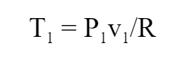 

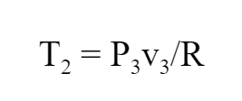 

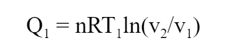 

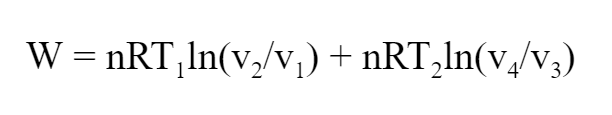 

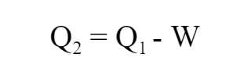 

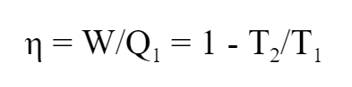 

 

<!-- # Below are the examples added for reference.
# To get mathematical equations in html format: go to link: https://www.codecogs.com/latex/eqneditor.php and download equations in png format
# In the same link you have option to download equation as punching

### using png -->
<!--
//markdown syntax -->

<!-- //html syntax

 -->

**3. Flowchart**:

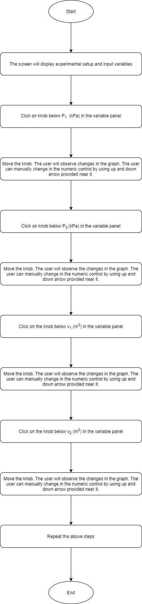

**4. Mindmap**:

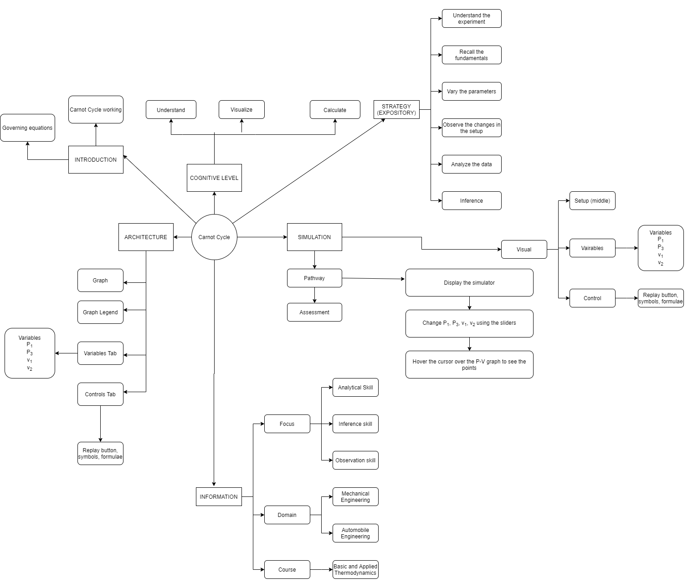

**5. storyboard**:

1. In the simulation window, the Carnot cycle graph is displayed.

 

2. The various symbols and the formulae involved in the experiment are displayed in the control panel when the cursor hovers over ‘Symbols’ and ‘Formulae’ respectively.

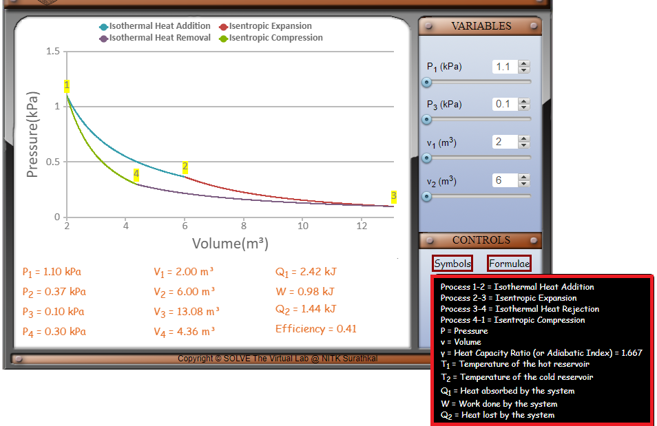 

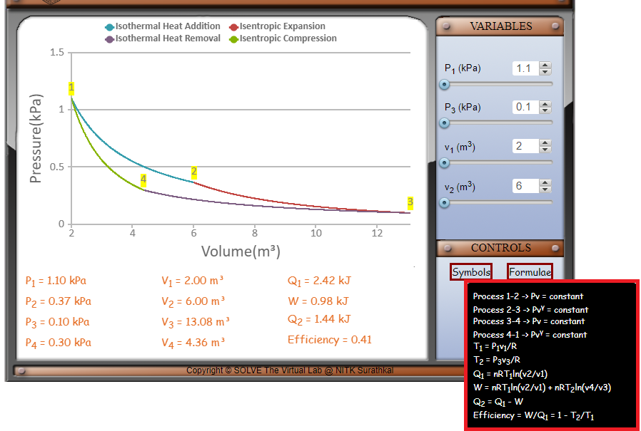 

3. The parameters of the system can be changed by changing the variables as shown below. 

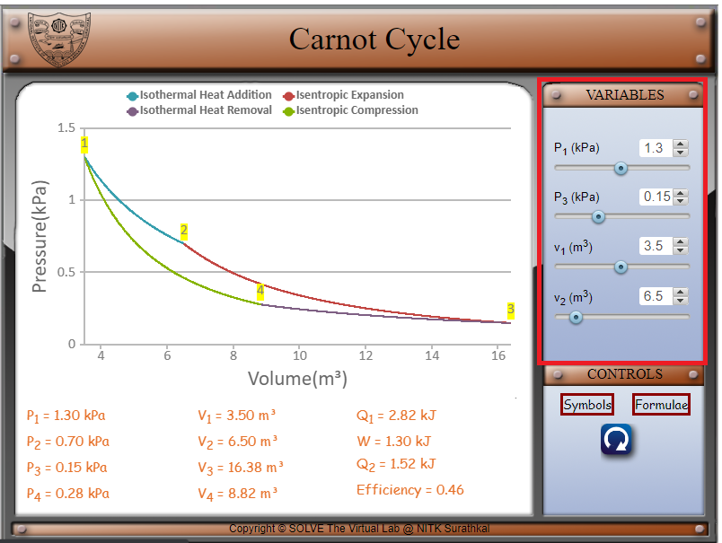 

4. Move the sliders’ knobs to vary the pressures P1 and P3, the volumes v1 and v2. P1 can be varied from 1.1 to 1.5 kPa. P3 can be varied from 0.1 to 0.25 kPa. V1 can be varied from 2 to 5 m3. V2 can be varied from 6 to 9 m3. 

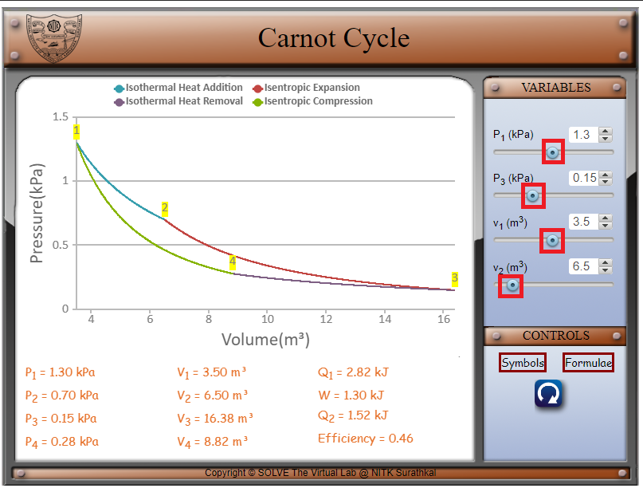 

5. P1, P2, P3, P4, v1, v2, v3, v4, the heat added Q1, work done W, the heat removed Q2 and the efficiency are displayed at the bottom. 

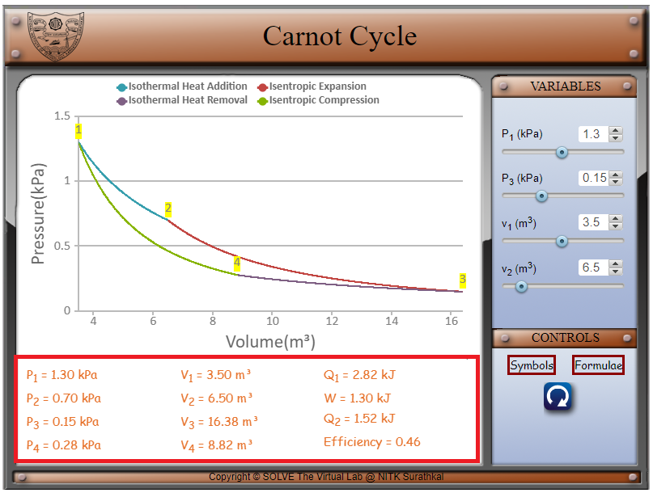 

6. Visualize the change in the graph as the various parameters are changed.

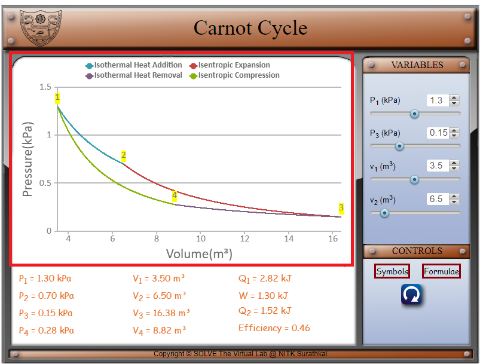 

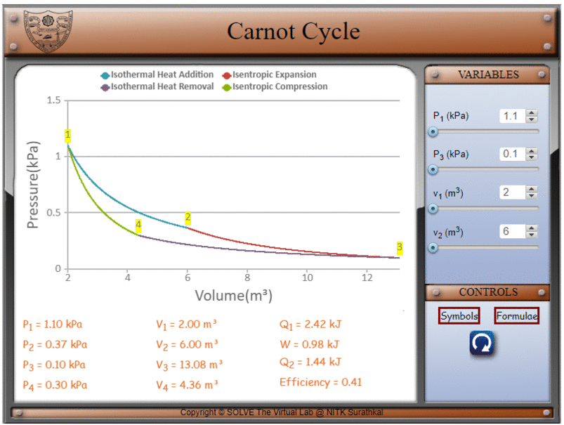

**6. References**:

Basic and Applied Thermodynamics - P.K. Nag
Thermodynamics: An Engineering Approach - Yunus A Cengel, Michael A Boles
